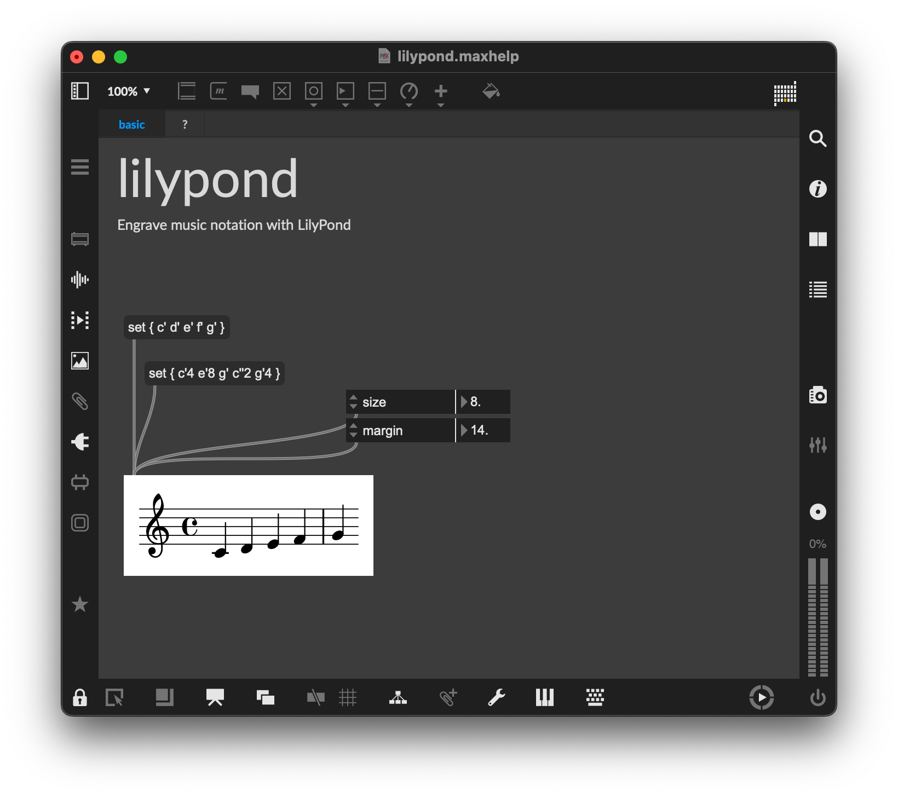

# max-lilypond

A Max package providing **`lilypond`**, a UI external that engraves
[GNU LilyPond](https://lilypond.org/) music notation directly inside a Max
patcher. 



> **In development.** The external is currently macOS-only (x64 and arm64);
> Windows support is planned.

## How it works

The `lilypond` object shells out to an installed `lilypond` binary as a
subprocess, has it write a cropped SVG, and draws that via Max's vector
graphics.

### Finding LilyPond

LilyPond is not bundled; the binary is discovered at render time.

## Building

```
# Configure
cmake -B build           \
    -S .                 \
    -G Ninja             \
    -DCMAKE_BUILD_TYPE=Debug

# Build
cmake --build build
```

This assembles a complete Max package under `build/package` (with the external
in `build/package/externals/`) rather than writing into the source tree.
Override with `-DMAX_SDK_PACKAGE_OUT_OF_TREE=OFF` to build into the source tree
instead.
